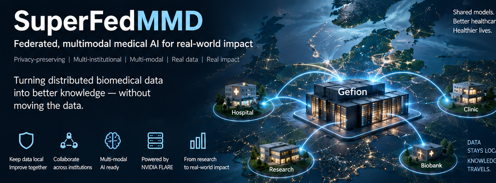
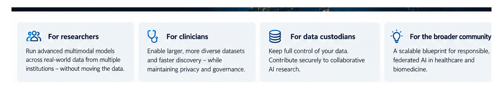
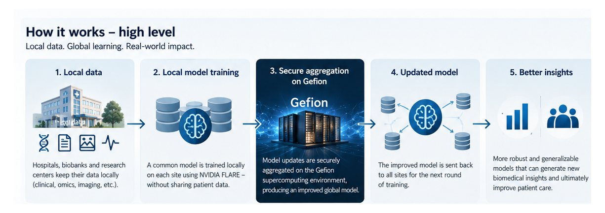
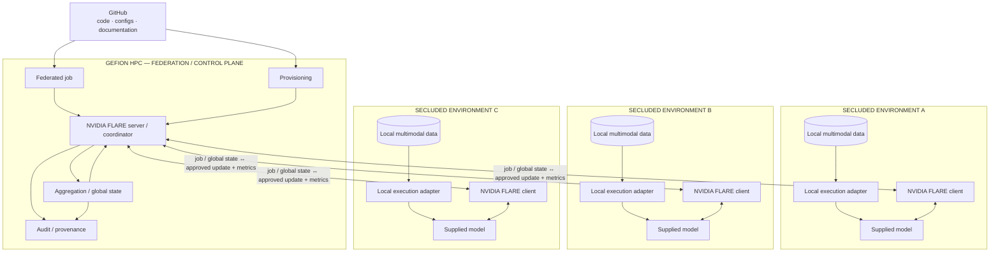
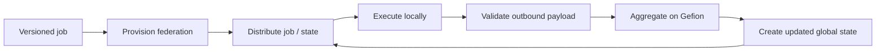
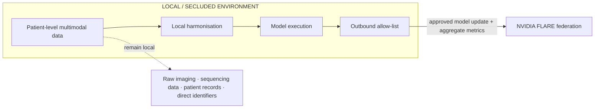
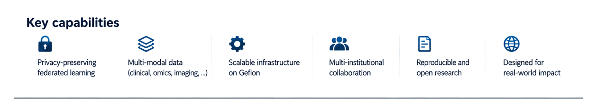

<p align="center">
  
</p>

# SuperComputer Federated MultiModal Diagnostics

## Federated learning of multimodal biomedical models across isolated data environments

SuperFedMMD is an infrastructure prototype for hospitals, biobanks and research environments that want to collaborate on multimodal biomedical AI while keeping patient-level source data under local control.

The project uses **Gefion** as the supercomputing environment and **NVIDIA FLARE** as the federation layer. The predictive model itself is intentionally replaceable: SuperFedMMD focuses on the infrastructure required to distribute, execute, coordinate, aggregate and reproduce a federated multimodal workflow.

<p align="center">
  
</p>

---

## Table of contents

- [Quick start / How-To](#quick-start--how-to)
- [How it works — high level](#how-it-works--high-level)
- [Why this architecture?](#why-this-architecture)
- [Architecture](#architecture)
- [Infrastructure method](#infrastructure-method)
- [Data boundary](#data-boundary)
- [Key capabilities](#key-capabilities)
- [Reference use case — RADIANT](#reference-use-case--radiant)
- [Reproducibility and provenance](#reproducibility-and-provenance)
- [Current project status](#current-project-status)
- [Team 6](#team-6)
- [Documentation](#documentation)
- [Appendix](#appendix)
- [Original concept material](#original-concept-material)
- [References and resources](#references-and-resources)

---

## Quick start / How-To

> **Status:** Hackathon proof of concept under active development. Commands marked `[TO CONFIRM]` will be replaced by the exact commands used in the working Gefion/FLARE implementation.

### 1. Clone the repository

```bash
git clone https://github.com/collaborativebioinformatics/SuperFedMMD.git
cd SuperFedMMD
```

### 2. Prepare the federation

The target topology consists of one federation/control plane associated with Gefion and multiple isolated client environments.

```text
Gefion
└── NVIDIA FLARE server / federation coordinator

Secluded environment A
└── NVIDIA FLARE client + local data + supplied model

Secluded environment B
└── NVIDIA FLARE client + local data + supplied model

Secluded environment C
└── NVIDIA FLARE client + local data + supplied model
```

Each participating environment must implement the same versioned federation/data contract.

### 3. Start the Gefion-side federation components

```bash
# Tested Gefion / FLARE server startup command:
[TO CONFIRM]
```

### 4. Start or connect each secluded client

```bash
# Tested FLARE client startup command:
[TO CONFIRM]
```

### 5. Submit the federated job

```bash
# Tested job submission command:
[TO CONFIRM]
```

The job contains the versioned execution code/configuration required to invoke the supplied model at participating sites.

### 6. Verify the run

A successful infrastructure round should demonstrate:

```text
global model / state
        ↓
distribution to secluded clients
        ↓
site-local model execution
        ↓
approved update + aggregate metrics
        ↓
Gefion / FLARE aggregation
        ↓
updated global state
        ↓
redistribution
```

The final reproducible run should record its Git commit, FLARE version, Gefion/runtime configuration, participating clients, federation configuration, round metadata and model/state identifiers.

---

## How it works — high level

<p align="center">
  
</p>

**Local data stay local. The computation travels. Model knowledge is aggregated.**

---

## Why this architecture?

Modern biomedical models increasingly combine imaging, genomic, molecular and clinical information. The relevant datasets, however, are often distributed across institutions that cannot simply pool raw patient data into a single environment.

SuperFedMMD addresses the infrastructure problem by moving a common, versioned execution workflow to participating data environments rather than moving the source datasets to the model.

This motivates three architectural requirements:

1. **Local data sovereignty** — patient-level data remain under the control of the originating environment.
2. **Common execution contract** — participating sites expose compatible model-facing inputs and federation outputs.
3. **Central coordination without centralised raw data** — Gefion and NVIDIA FLARE coordinate jobs, model-state exchange, aggregation and provenance.

These requirements lead directly to the infrastructure method used below.

---

## Architecture



The **model is a pluggable component**. Team 6 focuses on the infrastructure around it: environment provisioning, federation, execution, data boundaries, orchestration and reproducibility.

---

## Infrastructure method

A SuperFedMMD experiment starts from version-controlled code and configuration. A federated job and common contract are prepared, server/client environments are provisioned, and participating clients connect to the federation.

The federation distributes the active job and global model/state to clients. Each client executes the supplied model against its own local data. Before any output leaves the local environment, the outbound payload is restricted to explicitly approved model objects, updates and aggregate metrics. Gefion-side federation logic combines the returned state and creates the next global state for redistribution.



Detailed scientific/technical wording is maintained in [Methods](docs/methods.md).

---

## Data boundary

Raw biomedical data are not part of the default federation payload.



The federation interface is intended to be deny-by-default.

---

## Key capabilities

<p align="center">
  
</p>

The infrastructure is intended to support heterogeneous multimodal sites, reproducible federated execution, controlled outbound communication and multi-institution collaboration without centralising the underlying biomedical source data.

---

## Reference use case — RADIANT

RADIANT is used as the initial multimodal reference use case because it combines clinical, imaging-derived and molecular data.

For infrastructure testing, subjects can be assigned to mutually exclusive virtual environments that emulate independent institutions. This allows the federation, local execution, modality handling, aggregation and provenance mechanisms to be exercised without making the infrastructure dependent on one particular model architecture.

The RADIANT-specific materials are maintained separately under [`docs/radiant-fl/`](docs/radiant-fl/).

---

## Reproducibility and provenance

A demonstrable run should record at least:

```text
Git commit SHA
NVIDIA FLARE version
Gefion execution configuration
runtime / container identifier
federation-contract version
job configuration
participating client IDs
model / configuration identifier
federation round
input/output global-state identifiers or hashes
timestamps
execution status
```

Documentation should distinguish clearly between **target architecture**, **implemented components** and **verified execution**.

---

## Current project status

SuperFedMMD is under active development during the hackathon. The immediate infrastructure work focuses on Gefion execution, NVIDIA FLARE server/client setup, job packaging, secluded/simulated environments, local execution interfaces, outbound data boundaries, logging and an end-to-end reproducible federation round.

Model architecture and disease-specific model optimisation are handled separately from the primary Team 6 infrastructure workstream.

---

## Team 6

- Martin Thompsen
- Kalle Falk
- Elise Delzant
- Aditya Khadkikar
- Thomas Lindestrand — writer
- Shambhavi Pandey
- Juan L Rodriguez Flores
- Maria del Carmen Asencio

---

## Documentation

- [Methods — infrastructure and federation](docs/methods.md)
- [RADIANT-FL overview](docs/radiant-fl/README.md)
- [Reference architecture](docs/radiant-fl/architecture.md)
- [Development flowchart](docs/radiant-fl/development-flowchart.md)
- [Federation and data contract](docs/radiant-fl/data-contract.md)

### Appendix

- **[Appendix A — Infrastructure implementation checklist](docs/appendix-implementation-checklist.md)**

---

## Original concept material

The original hand-drawn diagrams are retained as project provenance and remain available in the repository.

---

## References and resources

- RADIANT public dataset: https://registry.opendata.aws/radiant/
- RADIANT paper: https://pmc.ncbi.nlm.nih.gov/articles/PMC11697432/
- Associated RADIANT analysis repository: https://github.com/d3b-center/pLGG-immune-clinicoradiomics
- NVIDIA FLARE: https://github.com/NVIDIA/NVFlare
- NVIDIA FLARE documentation: https://nvflare.readthedocs.io/en/main/index.html
