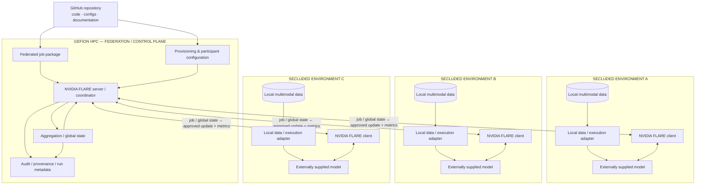
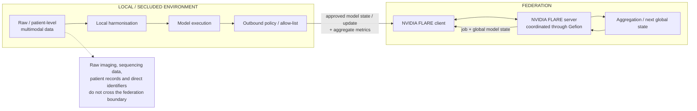
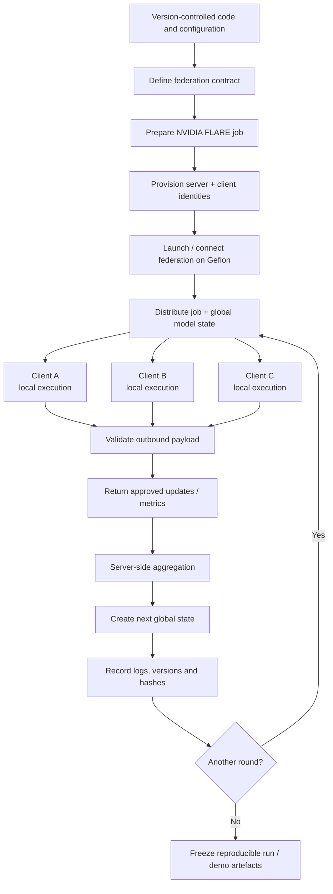

# Supercomputing-based Federated Multimodal Diagnostics

**Team 6 — Nordic Biobank × NVIDIA Federated Learning Hackathon, Copenhagen, 16–18 September 2026**

Team 6 is developing the **infrastructure and execution architecture** required to run multimodal biomedical models across isolated or secluded data environments, coordinated through the **Gefion HPC environment**.

The project is deliberately **model-agnostic**. Development of the predictive model itself is handled separately; our system treats the model as a pluggable local execution component.

## Project objective

The systems question is:

> **Can the same versioned multimodal model job be executed reproducibly across multiple isolated data environments while patient-level data remain local and Gefion coordinates the federated workflow?**

The hackathon proof of concept focuses on:

- provisioning and connecting federated participants;
- coordinating execution through Gefion;
- distributing a model/job definition to isolated environments;
- executing the supplied model against site-local multimodal data;
- returning only explicitly permitted model updates and aggregate metrics;
- aggregating and redistributing global model state;
- recording sufficient configuration and provenance to reproduce a run.

RADIANT is used as the first multimodal reference use case, but the infrastructure is intended to support other compatible biomedical datasets and models.

---

## System architecture

The diagram below formalises the original hand-drawn Team 6 architecture into a version-controlled systems diagram.



### Data boundary

Raw biomedical data remain inside the secluded environment. The federation interface is deny-by-default.



---

## Infrastructure workflow

The primary Team 6 deliverable is an executable and reproducible infrastructure workflow.



The internal model architecture, loss function and model-specific optimisation are outside the main Team 6 infrastructure scope.

---

## Product

The Team 6 product is not a specific trained model. It is a reusable **federated execution environment** consisting of:

| Component | Responsibility |
|---|---|
| **Gefion execution environment** | HPC execution and federation/control-plane compute |
| **NVIDIA FLARE server** | Federation coordination and global workflow |
| **NVIDIA FLARE clients** | Connect isolated environments to the federation |
| **Local execution adapter** | Maps local data to the interface expected by the supplied model |
| **Federation contract** | Defines compatibility, schemas and permitted outbound objects |
| **Job/configuration package** | Makes an experiment deployable and reproducible |
| **Audit/provenance layer** | Captures software, configuration, participants, rounds and model-state hashes |
| **Documentation** | Describes the architecture, process and reproducible execution pathway |

---

## Reference use case: RADIANT

The initial proof of concept uses the multimodal RADIANT paediatric low-grade glioma resource.

RADIANT is useful as an infrastructure test case because it includes multiple biomedical data modalities. For the PoC, discovery subjects can be partitioned into mutually exclusive virtual sites that emulate independent institutions.

Team 6 uses the dataset to exercise:

- isolated site-local data access;
- multimodal data interfaces;
- heterogeneous modality availability;
- federated client execution;
- controlled outbound communication;
- aggregation and redistribution;
- reproducibility and audit logging.

The infrastructure is not coupled to a particular RADIANT model architecture.

---

## Federation contract

Every participating environment must implement the same versioned interface for:

- cohort and subject semantics;
- modality / feature schemas;
- local preprocessing and harmonisation;
- missing-modality representation;
- model and configuration version;
- trainable parameter allow-list;
- outbound object and metric allow-list;
- software / environment version;
- model and configuration hashes;
- run and federation-round metadata.

See [Federation and data contract](docs/radiant-fl/data-contract.md).

---

## Reproducibility and provenance

A demonstrable run should be traceable to a reproducible configuration.

At minimum, record:

```text
Git commit SHA
NVIDIA FLARE version
Gefion execution configuration
environment / container identifier
federation contract version
job configuration
participating client IDs
model / configuration identifier
federation round
global-state hash before and after the round
timestamps
execution status
```

Documentation should distinguish clearly between **target architecture**, **implemented components**, and **verified execution**. A component is only described as operational once it has been reproduced in the running hackathon environment.

---

## Technical definition of done

The primary success criterion is infrastructure-level:

```text
versioned federated job
        ↓
Gefion / NVIDIA FLARE coordination
        ↓
multiple isolated clients
        ↓
site-local model execution
        ↓
approved outbound model update
        ↓
aggregation
        ↓
redistributed global state
        ↓
auditable and reproducible run
```

The proof of concept is successful when this pathway can be demonstrated without transferring raw patient-level source data between secluded environments.

Predictive model performance is a separate evaluation axis from infrastructure validation.

---

## Current hackathon status

This repository is being developed during the hackathon. The current implementation effort is focused on:

1. Gefion access and execution setup;
2. NVIDIA FLARE server/client configuration;
3. federated job packaging;
4. multiple secluded / simulated client environments;
5. local execution interfaces;
6. communication and outbound-data boundaries;
7. provenance and logging;
8. an end-to-end infrastructure demonstration.

This section should be updated as components are verified.

---

## Documentation

- [Methods — infrastructure and federation](docs/methods.md)
- [RADIANT-FL overview](docs/radiant-fl/README.md)
- [Reference architecture](docs/radiant-fl/architecture.md)
- [Development flowchart](docs/radiant-fl/development-flowchart.md)
- [Implementation checklist](docs/radiant-fl/implementation-checklist.md)
- [Federation and data contract](docs/radiant-fl/data-contract.md)

---

## Team 6

- Martin Thompsen
- Kalle Falk
- Elise Delzant
- Aditya Khadkikar
- Thomas Lindestrand — writer
- Shambhavi Pandey
- Juan L Rodriguez Flores
- Maria del Carmen Asencio

---

## Original concept material

The original hand-drawn project diagram is retained as project provenance and as the source for the structured infrastructure diagrams above.


Additional concept sketches are retained under `docs/radiant-fl/IMG_0071.jpg` and `docs/radiant-fl/IMG_0072.jpg`.

---

## References and resources

- RADIANT public dataset: https://registry.opendata.aws/radiant/
- RADIANT paper: https://pmc.ncbi.nlm.nih.gov/articles/PMC11697432/
- Associated RADIANT analysis repository: https://github.com/d3b-center/pLGG-immune-clinicoradiomics
- NVIDIA FLARE: https://github.com/NVIDIA/NVFlare
- NVIDIA FLARE documentation: https://nvflare.readthedocs.io/en/main/index.html
