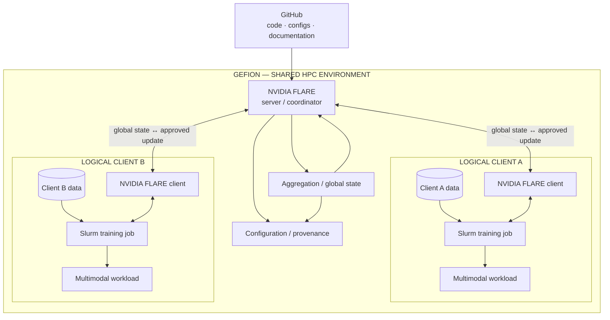
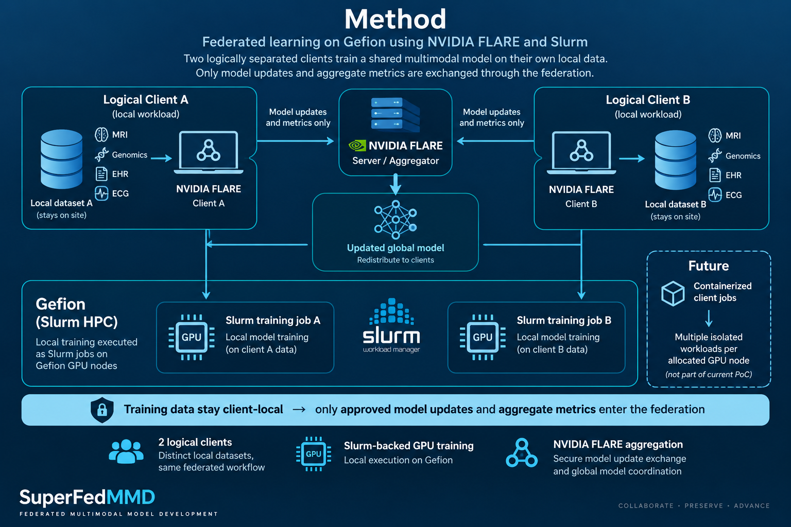
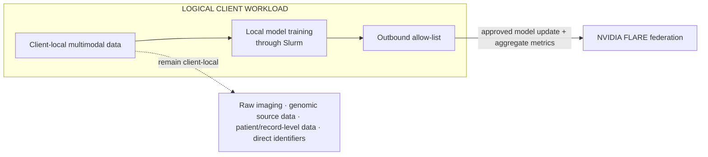
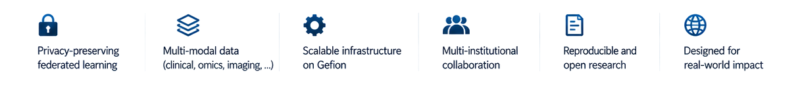

# SuperFedMMD

## SuperComputer Federated MultiModal Diagnostics

<p align="center">
  
</p>

## Federated learning of multimodal biomedical models across distributed data environments

<p align="center">
  
</p>

<h2 align="center">
  <em>Local data stay local, and the computation travels.<br>
  Model parameters and model updates are aggregated.</em>
</h2>

SuperFedMMD is an infrastructure proof of concept for federated multimodal biomedical AI. The hackathon implementation demonstrates how **two logically separated data sites** can participate in a common federated learning workflow on Gefion without combining their underlying training datasets.

The project uses **Gefion** as the shared high-performance computing environment, **NVIDIA FLARE** as the federation layer, and **Slurm** for compute-intensive local training jobs. The predictive model itself is intentionally replaceable: SuperFedMMD focuses on the infrastructure required to coordinate, execute, aggregate and reproduce a federated multimodal workflow.

<p align="center">
  
</p>

---

## Table of contents

- [How it works — high level](#how-it-works--high-level)
- [Quick start / How-To](#quick-start--how-to)
- [Dataset — demonstration workload](#the-dataset)
- [Architecture](#architecture)
- [Why this architecture?](#why-this-architecture)
- [Infrastructure method](#infrastructure-method)
- [Data boundary](#data-boundary)
- [Key capabilities](#key-capabilities)
- [Reference workload — Multimodal Healthcare](#reference-workload--multimodal-healthcare)
- [Reproducibility and provenance](#reproducibility-and-provenance)
- [Current project status](#current-project-status)
- [Proof-of-concept limitations](#proof-of-concept-limitations)
- [Future work](#future-work)
- [The SuperFed team](#the-superfed-team)
- [Documentation](#documentation)
- [References and resources](#references-and-resources)

---

## How it works — high level


SuperFedMMD separates **federation orchestration** from **client-local training**. NVIDIA FLARE coordinates the exchange of model state and updates, while each logical client trains only on its own configured dataset. Compute-intensive training is submitted through Slurm.

Presentation: [SuperFedMMD Mid-Term Presentation](docs/assets/Mid-Term%20Presentation%20-%20SuperFedMMD.pptx)

---

## Quick start / How-To

> **Status:** Hackathon proof of concept. Exact commands should reflect the final working Gefion/NVIDIA FLARE configuration. Any remaining `[TO CONFIRM]` placeholders must be replaced only after the corresponding step has been verified.

### 1. Clone the repository

```bash
git clone https://github.com/collaborativebioinformatics/SuperFedMMD.git
cd SuperFedMMD
```

### 2. Prepare the federation

The hackathon proof of concept uses **two logically separated NVIDIA FLARE clients within the shared Gefion environment**. Each client is configured with its own training-data directory, while compute-intensive local training is submitted through Slurm.

```text
Gefion shared environment
│
├── NVIDIA FLARE server / federation coordinator
│
├── Logical client A
│   ├── NVIDIA FLARE client
│   ├── client-specific data directory
│   └── local training → Slurm
│
└── Logical client B
    ├── NVIDIA FLARE client
    ├── client-specific data directory
    └── local training → Slurm
```

The two clients participate in the same federated workflow without combining their training datasets.

### 3. Start the Gefion-side federation components

```bash
# Tested Gefion / NVIDIA FLARE server startup command:
[TO CONFIRM]
```

### 4. Start or connect the two logical clients

```bash
# Tested NVIDIA FLARE client startup command:
[TO CONFIRM]
```

Each client must be configured with its own client-specific data path.

### 5. Submit local training through Slurm

```bash
# Tested local Slurm training submission command:
[TO CONFIRM]
```

The local training workload operates only on the dataset configured for that logical client.

### 6. Verify the federated run

A successful proof-of-concept round should demonstrate:

```text
global model / state
        ↓
distribution to two logical clients
        ↓
client-local Slurm training
        ↓
approved model update + aggregate metrics
        ↓
NVIDIA FLARE aggregation
        ↓
updated global model / state
        ↓
redistribution
```

The reproducible run should record its Git commit, NVIDIA FLARE version, Gefion/Slurm configuration, participating clients, client-local dataset partitions, federation configuration, Slurm job identifiers and model/state identifiers.

---

## The Dataset

The demonstration workload uses the **COHERENT dataset**:

- COHERENT dataset paper: https://www.mdpi.com/2079-9292/11/8/1199

The dataset is used to exercise the multimodal workflow and create distinct client-local partitions for federation testing.


---

## Architecture



The **model is a pluggable component**. The SuperFed team focuses on federation, execution, client-local data separation, Slurm orchestration, model/update exchange, aggregation and reproducibility.

In the hackathon proof of concept, both clients share the underlying Gefion administrative and computing environment. They therefore represent **logical federation sites**, not independently administered institutional security domains.

---

## Why this architecture?

Modern biomedical models increasingly combine imaging, genomic, molecular and clinical information. In real deployments, these data are often distributed across institutions that cannot simply pool raw patient-level data into one central environment.

SuperFedMMD explores the infrastructure pattern of moving a common federated workflow to the data rather than moving the underlying datasets into a shared training repository.

The architecture is built around three principles:

1. **Client-local training data** — each participating site trains on its own configured data.
2. **Common execution and federation contract** — clients expose compatible model-facing inputs and approved federation outputs.
3. **Central coordination without centralising training datasets** — NVIDIA FLARE coordinates model/state exchange and aggregation while Slurm provides compute resources for local training.

For the current proof of concept, data separation is logical and configuration-based. Institution-level security isolation is outside the scope of the hackathon implementation.

---

## Infrastructure method

To explore how federated multimodal learning can be coordinated on shared high-performance infrastructure, we implemented a proof-of-concept workflow on **Gefion** using **NVIDIA FLARE** for federation and **Slurm** for compute execution. Two logically separated clients are configured with distinct local data partitions, allowing the same multimodal workload to be trained independently at each client without combining the underlying datasets. Project and site setup can be managed through NVIDIA FLARE's integrated **Dashboard UI**, providing a simple interface for configuring participants, provisioning clients and distributing the required startup packages.

Each client submits its local training workload through Slurm and returns only approved model updates and aggregate metrics to the NVIDIA FLARE federation layer. These updates are aggregated into a new global model state and redistributed to the participating clients for subsequent training rounds. In the current hackathon implementation, both clients share the underlying Gefion environment; the proof of concept therefore demonstrates **federated orchestration, logical data separation and distributed model training**, rather than full institution-level security isolation.

<p align="center">
  
</p>

The model itself remains a **pluggable workload**: the infrastructure coordinates how training is executed and how model updates are exchanged, without coupling the federation to one particular model architecture or biomedical data modality.

Detailed implementation and methodological information is available in [Methods](docs/methods.md).

---

## Data boundary

Raw biomedical training data are not intended to be part of the NVIDIA FLARE federation payload.



The federation interface is intended to be **deny-by-default with respect to client training data**. In the current Gefion proof of concept, this separation is enforced by client configuration and distinct data paths rather than by institution-level infrastructure isolation.

---

## Key capabilities

<p align="center">
  <picture>
    <source media="(prefers-color-scheme: dark)" srcset="docs/assets/superfedmmd-capabilities-dark.png">
    <source media="(prefers-color-scheme: light)" srcset="docs/assets/superfedmmd-capabilities-light.png">
    
  </picture>
</p>

The infrastructure is designed to support reproducible federated execution, controlled exchange of model updates, heterogeneous multimodal workloads and future deployment across independently administered environments.

---

## Reference workload — Multimodal Healthcare

SuperFedMMD uses components from the [Multimodal Healthcare](https://github.com/multimodal-healthcare) project as its current reference workload. The project contains modality-specific and multimodal fusion components spanning areas such as MRI, genomics, electronic health records, clinical data and ECG.

Within SuperFedMMD, these components are treated as **pluggable local workloads** rather than as part of the federation infrastructure itself. This allows the Gefion/NVIDIA FLARE execution path to be tested without coupling the infrastructure to one specific predictive model architecture.

For the hackathon demonstration, the workload is run against distinct client-local partitions. The demonstration dataset itself is described in [The Dataset](#the-dataset) section above.

---

## Reproducibility and provenance

A demonstrable run should record at least:

```text
Git commit SHA
NVIDIA FLARE version
Gefion project / environment
Slurm partition
Slurm job IDs
allocated compute nodes
requested CPU / GPU / memory
runtime / environment identifier
FLARE communication configuration
federation-contract version
job / workload configuration
participating client IDs
client-local dataset / partition identifiers
model / configuration identifier
federation round
input global-state identifier / hash
output global-state identifier / hash
model artifact / output paths
timestamps
execution status
```

Documentation should distinguish clearly between **target architecture**, **implemented components** and **verified execution**.

---

## Current project status

The hackathon proof of concept focuses on demonstrating one complete federated execution path with **two logically separated clients** on Gefion.

The target demonstration is:

```text
two client-specific datasets
        ↓
two NVIDIA FLARE clients
        ↓
local training submitted through Slurm
        ↓
model/update exchange through NVIDIA FLARE
        ↓
server-side aggregation
        ↓
updated global model / state
```

The primary success criterion is that both clients can participate in the same federated learning workflow while training on distinct local datasets without combining the underlying training data.

Model accuracy is secondary to demonstrating that the federated execution path works end to end.

---

## Proof-of-concept limitations

The current implementation is a **systems proof of concept**, not a production deployment.

The participating federation sites are implemented as **logically separated client workloads within a shared Gefion computing environment**. They are not equivalent to independently administered institutional environments or security-isolated enclaves.

The proof of concept can therefore demonstrate:

- federated orchestration;
- logical separation of client-specific training datasets;
- client-local model execution through Slurm;
- model/update exchange;
- server-side aggregation;
- redistribution of updated model/state; and
- reproducible execution metadata.

It does **not** by itself demonstrate confidentiality against a privileged user with access to the underlying shared Gefion environment.

A production deployment across independent institutions would additionally require appropriate network isolation, identity and access management, credential/key management, governance, institutional agreements, information-security assessment, operational monitoring, privacy-risk assessment and application-specific validation.

---

## Future work

A future implementation could package client training workloads as **containerized jobs**. This would improve portability, dependency isolation and reproducibility across participating environments.

During the hackathon, GPU-backed Slurm workloads on Gefion were observed to receive a **full GPU-node allocation even when the requested workload required substantially fewer resources**. A future design could therefore investigate whether multiple isolated containerized client workloads can share a single allocated GPU node, where permitted by Gefion policy, scheduler configuration and the available container runtime. This could improve utilization of the hardware already allocated to the job without changing the logical federation model.

Other future extensions include:

- deployment across independently administered institutional environments;
- stronger network and identity isolation;
- automated client provisioning;
- production-grade monitoring and audit;
- explicit container/runtime versioning; and
- scaling beyond two federation clients.

Containerized execution and multi-client packing within a single GPU-node allocation are **future extensions** and are not required for the current hackathon proof of concept.

---

## The SuperFed team

- Martin Thompsen
- [Kalle Falk](https://www.linkedin.com/in/kalle-falk-611245175/)
- Elise Delzant
- Aditya Khadkikar
- [Thomas Hansen](https://dk.linkedin.com/in/tlhan)
- Shambhavi Pandey
- Juan L Rodriguez Flores

---

## Documentation

Current documentation:

- [Methods — infrastructure and federation](docs/methods.md)
- [Appendix A — Infrastructure implementation checklist](docs/appendix-implementation-checklist.md)

Earlier design and proof-of-concept material retained in the repository:

- [Federated workflow proof of concept](docs/radiant-fl/README.md)
- [Reference architecture](docs/radiant-fl/architecture.md)
- [Development flowchart](docs/radiant-fl/development-flowchart.md)
- [Data and federation contract](docs/radiant-fl/data-contract.md)

---

## References and resources

- Multimodal Healthcare: https://github.com/multimodal-healthcare
- COHERENT dataset: https://www.mdpi.com/2079-9292/11/8/1199
- NVIDIA FLARE: https://github.com/NVIDIA/NVFlare
- NVIDIA FLARE documentation: https://nvflare.readthedocs.io/en/main/index.html
