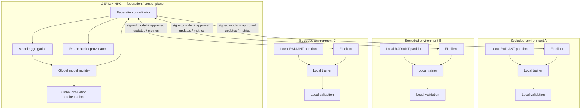
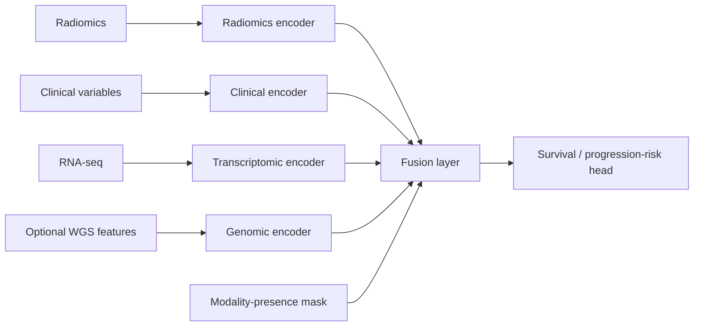

# RADIANT-FL reference architecture

## System topology

## Multimodal model concept

The initial model should support different modality availability between institutions and patients.

A site does not need to contain every modality in order to participate, provided the common model/update contract explicitly defines which components it may train and return.

## Federation contract

Every environment must share the same versioned contract for:

- patient identifier handling
- feature schemas
- outcome definition
- preprocessing rules
- train/validation partition semantics
- missing-modality representation
- model architecture and trainable parameter allow-list
- optimiser and local training configuration
- metrics allowed to leave the site
- parameters allowed to leave the site
- software/container version
- model and configuration hashes

## Privacy and security boundary

Allowed to cross the federation boundary:

- signed global model parameters
- explicitly approved local parameter updates
- approved aggregate/local validation metrics
- technical telemetry required for federation health

Not allowed to cross the boundary:

- raw MRI
- raw RNA-seq
- raw WGS
- patient-level clinical records
- direct identifiers
- unrestricted embeddings or intermediate representations
- arbitrary local files

Secure aggregation and/or additional privacy mechanisms can be enabled as the federation moves beyond the initial systems PoC.

## Virtual-site simulation

For the initial RADIANT PoC, secluded environments are simulated using mutually exclusive subject partitions from the discovery cohort.

The partitions should be intentionally non-IID when feasible, for example by varying:

- patient age distribution
- tumor location distribution
- outcome/progression prevalence
- molecular subtype prevalence
- modality availability

This is preferable to a purely random equal split because it exercises a central challenge of real multi-institution federation: heterogeneous local data distributions.

## Evaluation

The held-out replication cohort is never used for federation training.

Primary comparison:

- Local models
- Centralised reference model
- Federated global model

Suggested metrics:

- concordance index (C-index)
- Brier score
- calibration
- site-level validation performance
- convergence across federation rounds
- centralised-to-federated performance delta

The first milestone demonstrates technical feasibility and reproducibility; it is not a clinical validation claim.
