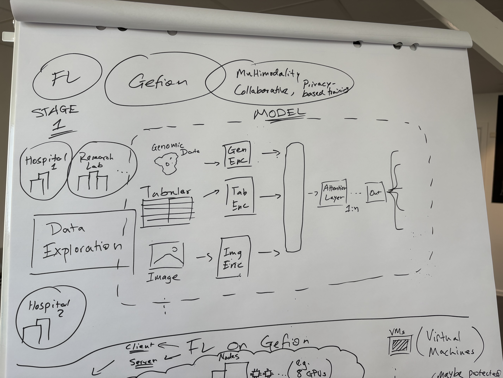
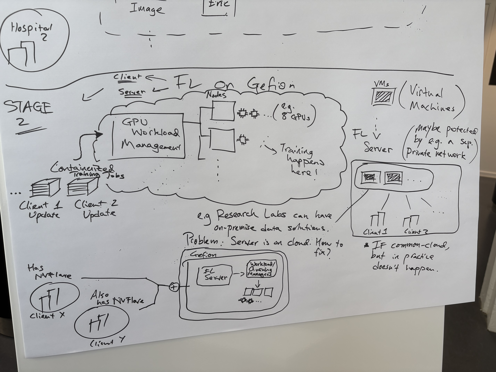
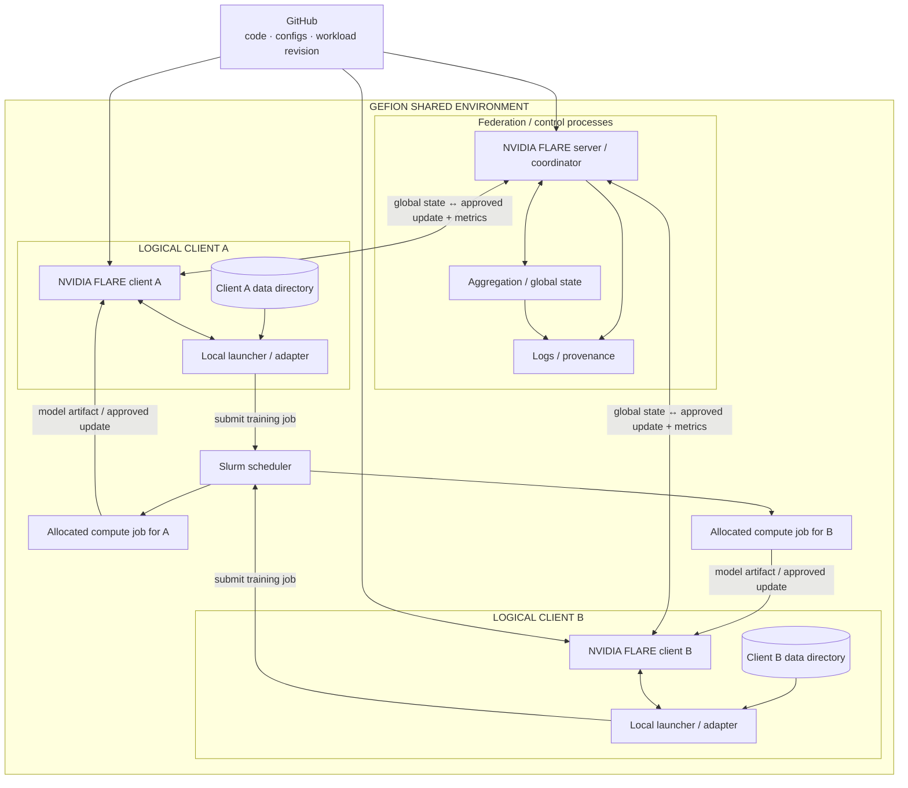

# SuperFedMMD reference architecture

> **Path note:** This file remains under the historical `docs/radiant-fl/` path for link compatibility. The active architecture is workload-agnostic and currently uses a Multimodal Healthcare fusion workload rather than RADIANT.

The original concept sketches are retained below as design provenance.




## Proof-of-concept topology

The Gefion proof of concept separates the system into:

1. a **NVIDIA FLARE federation/control plane**;
2. two **logically independent client control processes**;
3. two **client-specific data directories**; and
4. **Slurm-backed compute jobs** used for local training.



## Important implementation distinction

The diagram above represents **logical site separation**, not independent institutional isolation.

Both clients are currently hosted within the same Gefion environment for the hackathon proof of concept. Client-specific data paths are used so that each client workload operates only on its intended training data.

The design target for a later institutional deployment is different:

```text
Institution A                         Institution B
----------------                     ----------------
local data                           local data
local FLARE client                   local FLARE client
local compute                        local compute
       \                                /
        \-- authenticated federation --/
                    |
              FLARE coordinator
```

Such a deployment would require institution-specific IAM, network controls and privileged access boundaries. Those controls are outside the security claims of the current shared-Gefion proof of concept.

## Workload abstraction

The current reference model is supplied from the [Multimodal Healthcare](https://github.com/multimodal-healthcare) project.

SuperFedMMD does not require the federation infrastructure to be coupled to a single model architecture. A compatible workload must provide:

- a versioned model/training implementation;
- a defined input/data contract;
- a local training entry point;
- an approved model/update object that can be federated; and
- reproducible output artifacts.

The active modalities and exact fusion-model configuration used in the demonstration are recorded separately in the run configuration.

## Federation contract

Every logical client must use the same versioned contract for:

- client identity;
- workload/model revision;
- input schema and label semantics;
- preprocessing rules;
- local data-path semantics;
- Slurm resource/submission interface;
- trainable parameter/update schema;
- metrics permitted to leave the client;
- model artifacts and hashes; and
- software/runtime versions.

## Data and security boundary

Allowed to cross the federation boundary:

- global model/state objects;
- explicitly approved local parameter/model updates;
- approved aggregate metrics;
- sample counts or aggregation weights where configured;
- model/configuration hashes;
- technical telemetry required for federation health.

Not allowed to cross the federation boundary by default:

- raw client training data;
- raw imaging;
- raw genomic/sequencing source data;
- patient-level/record-level clinical source data;
- direct identifiers;
- arbitrary client-local files;
- unrestricted embeddings or intermediate activations.

## Slurm execution boundary

Compute-intensive local training should run through Slurm.

The client-local launcher is responsible for:

1. submitting the training job;
2. associating the Slurm job with the correct logical client;
3. pointing the job to the correct client-local data directory;
4. waiting for or retrieving the resulting model artifact/update;
5. recording Slurm job metadata; and
6. exposing only the approved update back to NVIDIA FLARE.

The exact model artifact/output location after job completion is:

```text
[TO CONFIRM ON GEFION]
```

## Technical evaluation

The primary systems-level demonstration is:

```text
global state
    ->
two logical clients
    ->
distinct local datasets
    ->
Slurm-backed local training
    ->
approved model/update exchange
    ->
aggregation
    ->
updated global state
    ->
redistribution
```

The first milestone demonstrates federated execution feasibility and reproducibility. It is not a production security or clinical validation claim.
