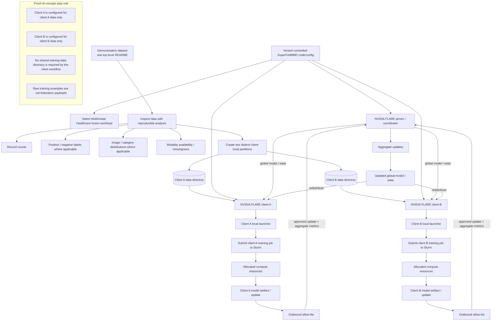

# Federated multimodal learning development flow

> **Path note:** This file is retained under the historical `docs/radiant-fl/` path. The active flow describes the current two-client Gefion proof of concept.

The current development goal is to demonstrate that two logically separated clients can train on distinct local data partitions through Slurm and participate in one NVIDIA FLARE federation without combining their training datasets.

## Current proof-of-concept flow



## Slurm verification

For each client training job, record:

```text
client_id
Slurm job ID
partition
allocated node
requested CPU / GPU / memory
start/end time
exit status
model artifact/output path
```

The model artifact path after completed jobs must be verified on Gefion before the final demo.

## Federation verification

A successful run should establish that:

1. the FLARE server sees both clients;
2. each client receives the expected global state/job;
3. each client launches training using its own data path;
4. Slurm executes both local training workloads;
5. approved updates return to the federation;
6. aggregation produces a new global state; and
7. the new state can be redistributed.

## Security interpretation

The current two-client layout is a **logical simulation of separate sites inside one shared Gefion environment**.

It does not demonstrate protection against a privileged user with access to the shared filesystem, scheduler or host environment.

A future institutional deployment would place clients under separate administrative/security domains and would require appropriate identity, network and access controls.

## Success criterion

The principal systems-level success criterion is:

> Two logically independent clients with distinct local training data successfully participate in a NVIDIA FLARE workflow coordinated on Gefion, execute their local training through Slurm, exchange only approved model/update information through the federation, and produce an aggregated global state that can be redistributed.

Predictive performance may be reported for demonstration purposes, but it is not the primary infrastructure success criterion.
