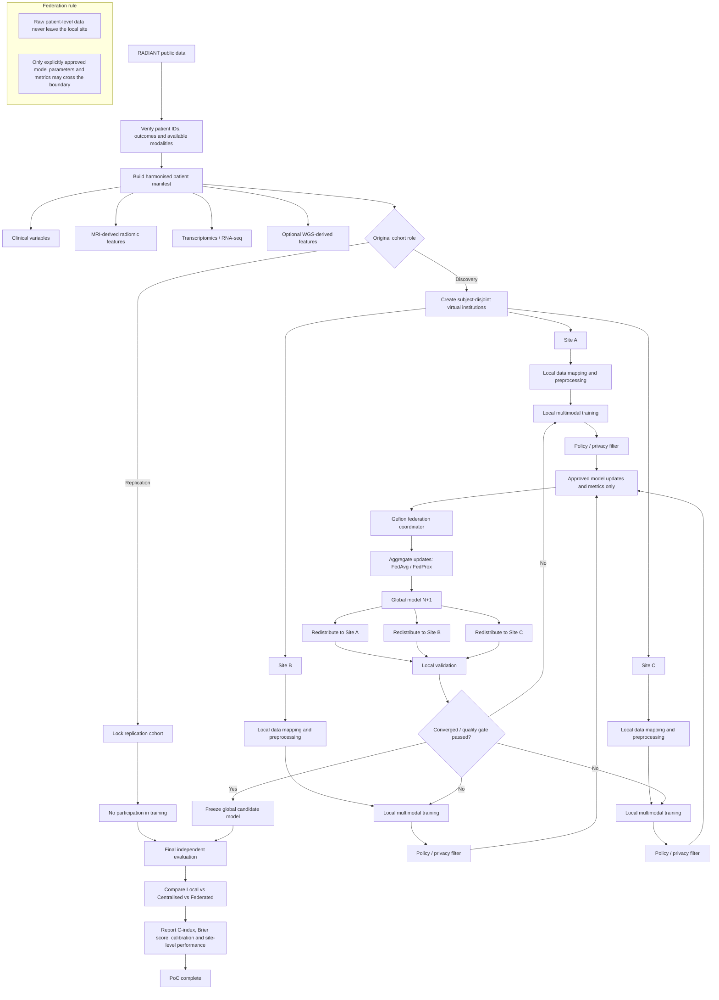
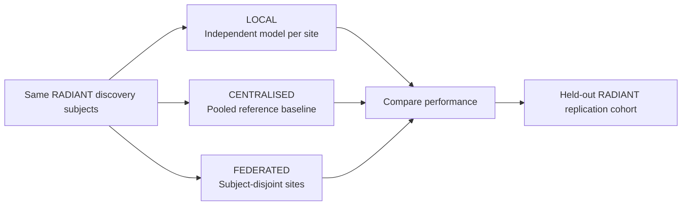

# Federated multimodal learning development flow

The diagram below defines the development and execution workflow for the RADIANT-FL proof of concept.

## Required comparison

The proof of concept should report three settings:

## Success criterion

The principal systems-level success criterion is:

> The federated model approaches the centralised reference performance while no raw patient-level data are transferred between secluded environments.

The first PoC is intended to prove the architecture and execution model, not to constitute a clinically validated model.
